# QuestEd データフロー図

## 概要

QuestEd新機能の主要なユースケースにおけるデータフローを図解しています。

---

## 1. 音声入力フロー

### 1.1 基本音声入力フロー

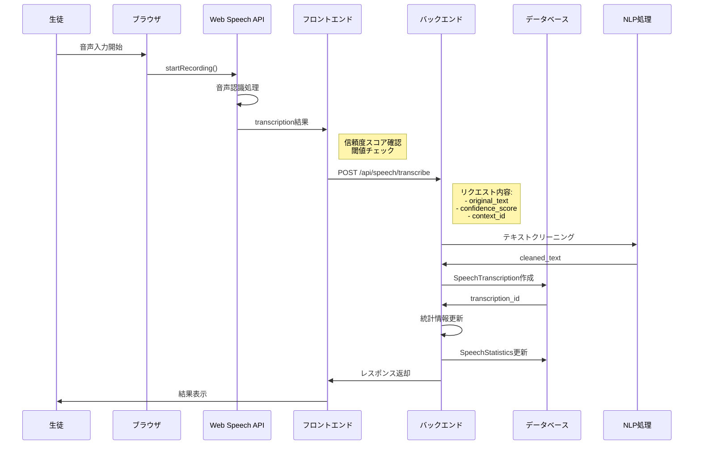

### 1.2 音声入力エラーハンドリング

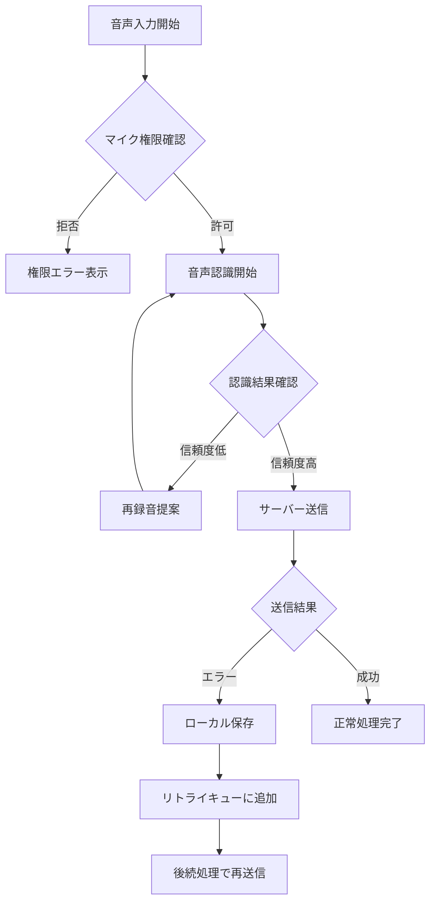

---

## 2. 自由進度学習フロー

### 2.1 単元選択から学習完了まで

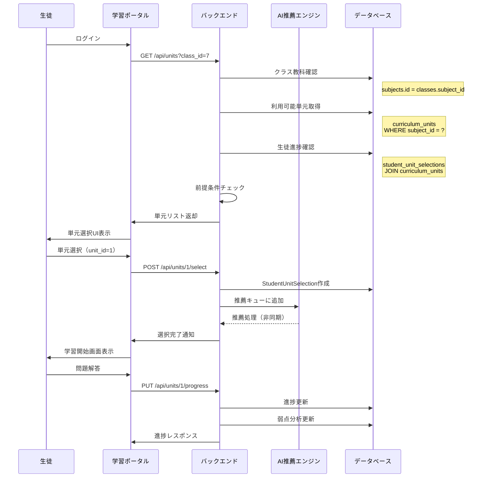

### 2.2 単元前提条件チェックフロー

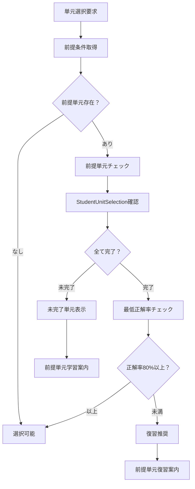

---

## 3. AI推薦システムフロー

### 3.1 推薦生成プロセス

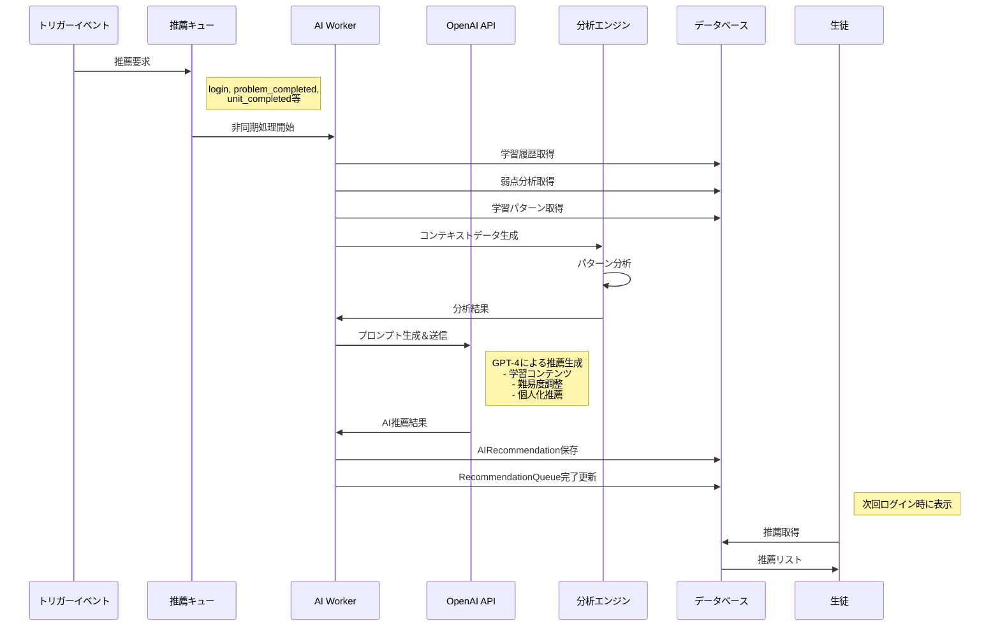

### 3.2 推薦効果測定フロー

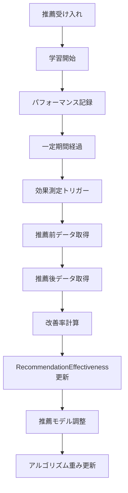

---

## 4. 復習問題生成フロー

### 4.1 AI復習セット生成フロー

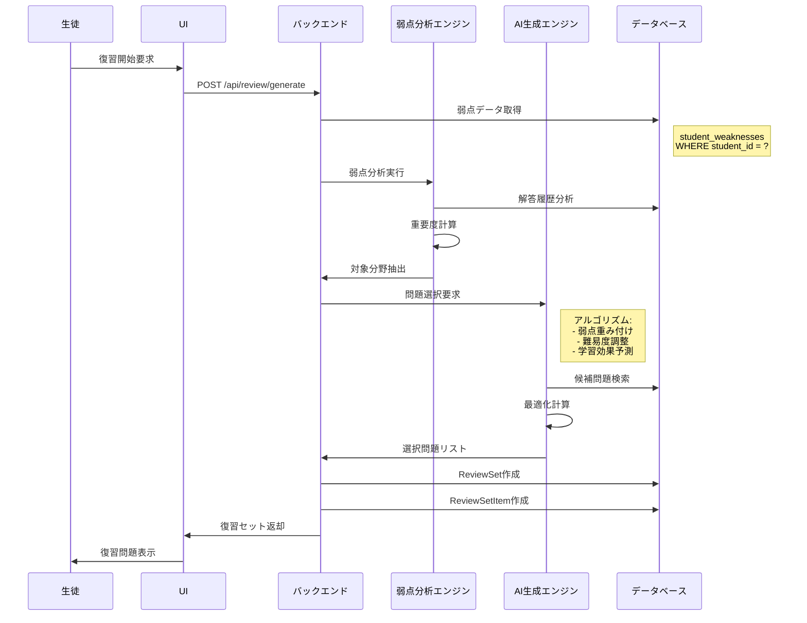

### 4.2 間隔反復学習スケジュール更新

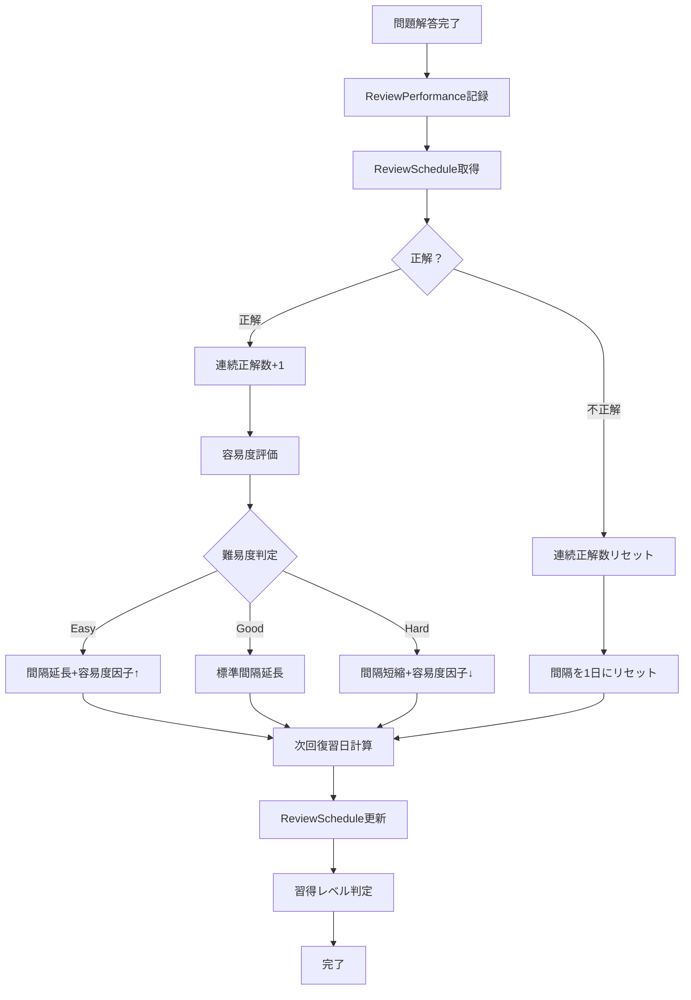

---

## 5. 教科フィルタリングフロー

### 5.1 教科別データアクセス制御

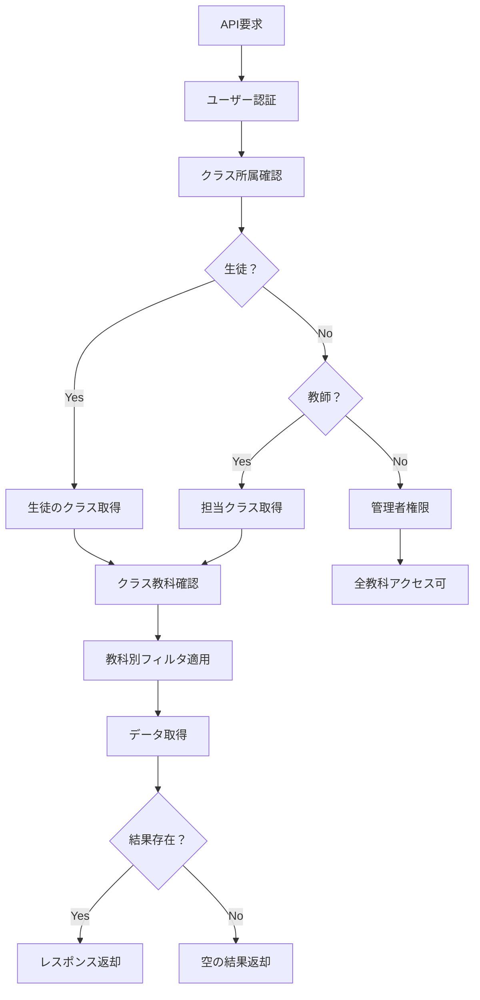

---

## 6. パフォーマンス最適化フロー

### 6.1 AI推薦キャッシュ戦略

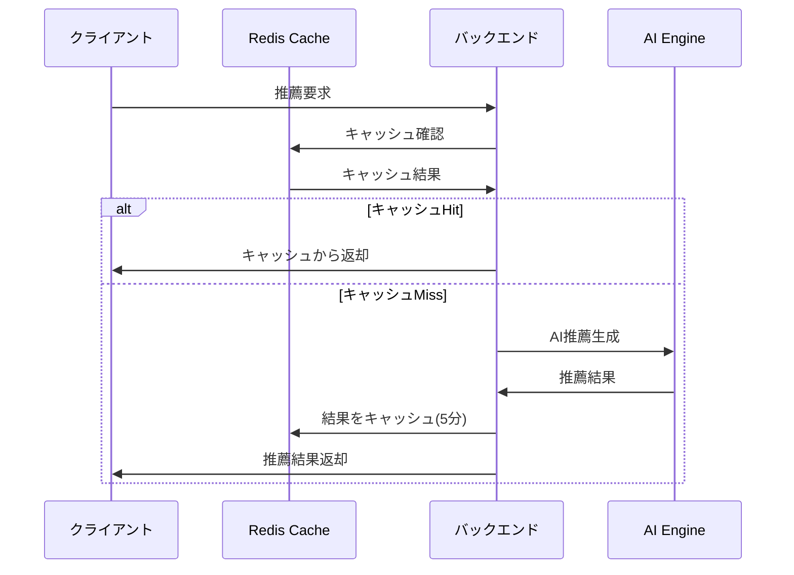

### 6.2 大量データページネーション

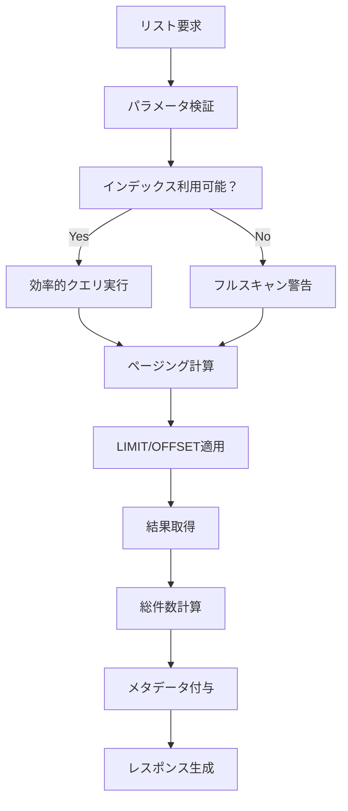

---

## 7. エラーハンドリングフロー

### 7.1 音声入力エラー処理

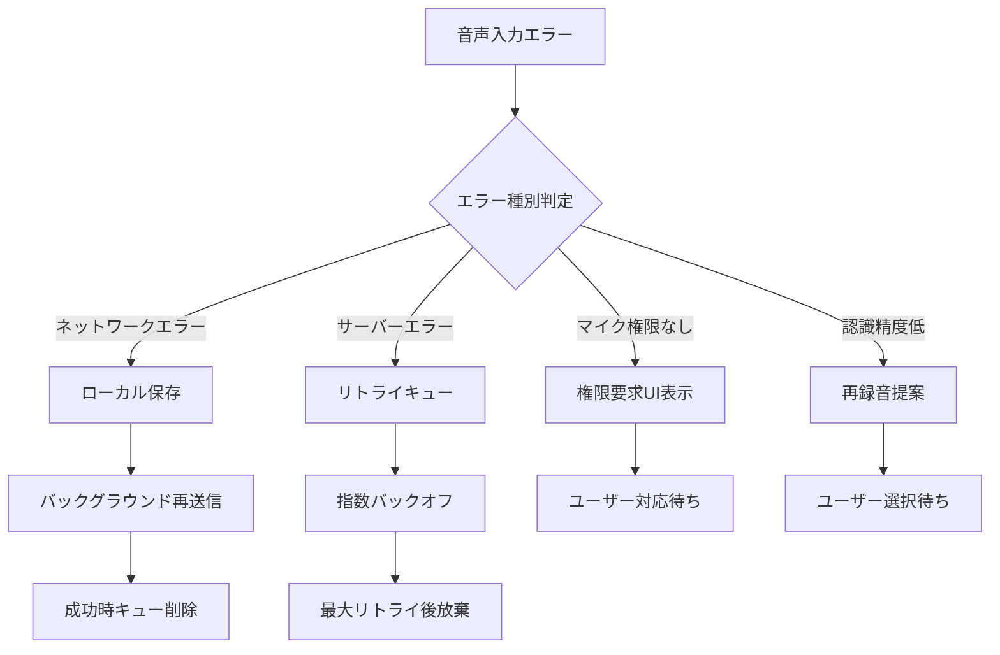

### 7.2 AI推薦エラー処理

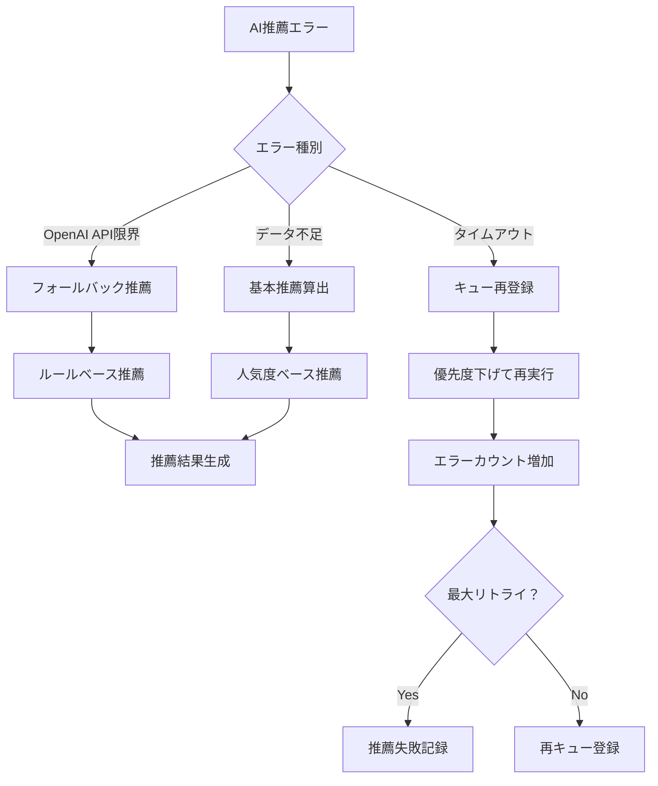

---

## まとめ

これらのデータフロー図により、QuestEd新機能の各システム間でのデータの流れと処理の詳細が明確になります。実装時には以下の点に注意してください：

### 重要な設計原則

1. **非同期処理**: AI推薦や重い分析処理は非同期で実行
2. **フォールバック**: 外部API失敗時の代替処理
3. **キャッシュ**: 頻繁にアクセスされるデータの効率化
4. **セキュリティ**: 教科別アクセス制御の徹底
5. **エラーハンドリング**: ユーザビリティを損なわない例外処理

### パフォーマンス考慮事項

1. **データベースインデックス**: 頻繁な検索条件への最適化
2. **ページネーション**: 大量データの効率的な取得
3. **並列処理**: 独立した処理の同時実行
4. **監視**: ボトルネックの早期発見

これらのフローに基づいて、実際の実装を進めることができます。